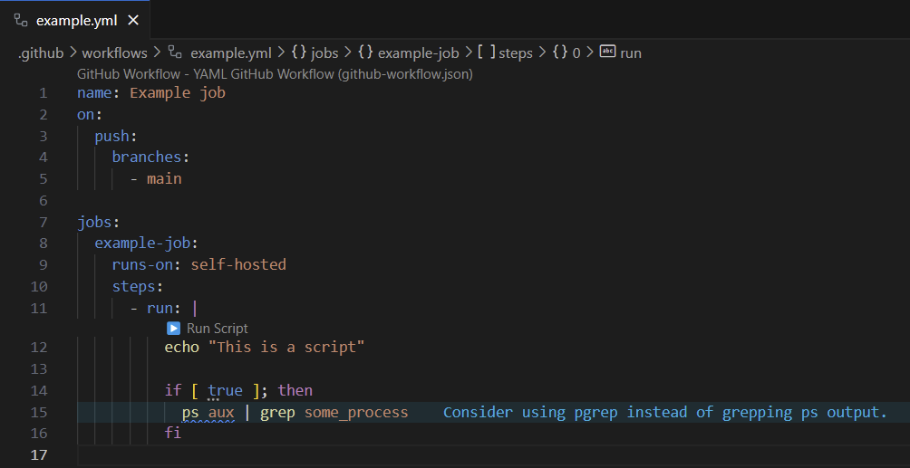

# GitHub Actions Scripts

➡️ This is a fork of [YAML with Script](https://gitlab.com/matthiesen-technology/yaml-with-script)
adapted to work for GitHub Actions instead of GitLab CI/CD

🚀 **Extend YAML files with embedded shell scripts and linting** – the perfect
solution for seamless automation and debugging directly within VS Code!

### 💡 Primary Use Case: **GitHub Actions**

This extension is specifically designed for **GitHub Actions**, making it easier
to work with workflow files. Automate, debug, and test your CI pipelines
without the need for constant commits and pushes.

---

## Features

- **CodeLens Integration**: Add interactive buttons to YAML files to execute
  shell scripts (`run`) with a single click.
- **ShellCheck Support**: Integrated linting to detect and fix issues in your
  shell scripts.
- **Real-time YAML Analysis**: Provides instant feedback on YAML file syntax
  errors and warnings directly in the VS Code Problems panel.
- **Optimized for GitHub Actions**: Simplifies working with GitHub workflows,
  including `run` blocks and composite actions.
- **Customizable Settings**: Configure script dialects, severity levels, and
  other options via the extension settings.

---

## Example Usage

### GitHub Actions workflow file with a script

`run` blocks are getting highlighted, checked
with [shellcheck](https://github.com/koalaman/shellcheck) and are executable
with a button click on `▶️ Run Script`.

### How to execute a script:

1. Open a github workflow file in VS Code.
2. Click the **CodeLens button** (`▶️ Run Script`) above your script.
3. The script is executed in a new terminal.

---

### Automated Debugging with ShellCheck

When errors are detected in your shell script, they are highlighted directly in
VS Code:

- **Severity Levels**:
  - Errors
  - Warnings
  - Info
  - Style

Quickly check issues with direct links to the
[ShellCheck documentation](https://www.shellcheck.net/wiki). _Unfortunately
quick actions are not implemented, but might be in the future._

---

### Settings

Customize the extension via VS Code settings:

| Setting                                | Description                                                                                                                                                                  |
| -------------------------------------- | ---------------------------------------------------------------------------------------------------------------------------------------------------------------------------- |
| `actions-with-script.enabled`          | Enable or disable the extension.                                                                                                                                             |
| `actions-with-script.enableRunButton`  | Enable or disable the `▶️ Run Script` CodeLens button.                                                                                                                       |
| `actions-with-script.baseScript`       | A global script to be executed before the YAML script is executed with a click on `▶️ Run Script` (e.g., `source ~/.env` or `source ~/.actions-with-script-base.sh`).        |
| `actions-with-script.dialect`          | Specify the shell dialect for ShellCheck (`bash`, `sh`, `dash`, `zsh`, etc.).                                                                                                |
| `actions-with-script.severity`         | Configure severity levels for ShellCheck (`error`, `warning`, `info`, `style`).                                                                                              |
| `actions-with-script.shellcheckFolder` | This is the path to the folder that includes 'shellcheck', e.g. (`/opt/homebrew/bin` will lead to `/opt/homebrew/bin/shellcheck --version`)                                  |

---

### Prerequisites

- **ShellCheck**: Ensure ShellCheck is installed and available in your `PATH`.
  [Install ShellCheck](https://www.shellcheck.net/).

## Known issues

* The first line of a script is not properly highlighted.
See [here](https://github.com/harrydowning/vscode-yaml-embedded-languages/issues/11).

## License

This software is released under the MIT License (see [License](LICENSE.md)).
